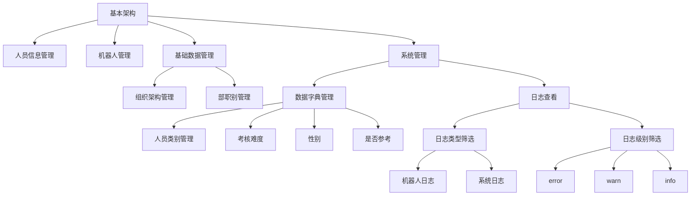

### 系统基本架构



### 添加机器人接口

接口地址：https://SERVER_IP:PORT/system/robotData/add

请求方法：POST application/json

上传数据格式

```json
{
	"name":"名称",
	"code":"编号",
	"ip":"IP地址"
}
```

返回数据格式

```json
{
    "success": false,
    "message": "机器人编号已经存在！",
    "code": 500
}

{
    "success": true,
    "message": "操作成功！",
    "code": 200
}
```

**接口说明：**服务端接收终端设备注册消息进行终端设备注册。设备注册后，平台前端页面需要能够对注册后的设备进行单个、多个增删改查。属于机器人管理页面功能。

### 心跳监测接口

接口地址：[https://SERVER_IP:PORT/](http://47.104.11.154:8180/)system/robotState/add

请求方法：POST application/json

上传数据格式

```json
{
	"robotCode": "",
	"robotState": 0,    // 0：空闲  1：考核中
	"task":"单杠引体向上",   //正在考核的项目，通过数据字典管理
	"latitude": "",     // 纬度
	"longitude":""    // 经度 
}
```
返回数据格式

```json
{
	"result": "update" | "begin_exam_单杠引体向上" | "begin_train_单杠引体向上" | "begin_test_单杠引体向上" | "end" | "update_user" | "update_user_all",
    "userInfoVersion": "20230905171857"
}
```

**接口说明：**

- 心跳监测接口返回数据result值是`update`时，表示平台通知机器人拉取规则。值是`begin_train_项目名称`表示开始该项目考核，值是`begin_train_项目名称`表示开始该项目训练，值是`begin_test_项目名称`表示开始该项目体验，`end`表示结束当前考核，`update_user`表示更新用户数据，`update_user_all`表示清除本地用户信息，更新所有用户数据。不需要发送任何指令的时候返回`"result": ""`

- userInfoVersion：用于标识服务器当前用户信息版本，版本号是用户信息最近一次更新时间。userInfoVersion字段是"0"时，表示服务器没有用户信息。此字段与人员数据接口相关。
- 项目名称：单杠引体向上、单杠屈臂悬垂、俯卧撑、仰卧卷腹、30米×2蛇形跑、3000米跑。
- 页面显示已添加机器人的在线、离线状态，5min未收到心跳默认设备离线，设备在线的情况下显示设备空闲、考核中两种状态，如果设备在考核中同时显示正在考核的项目名称。
- 机器人管理页面内容包括将通过`/system/robotData/add`接口注册设备的单个、多个增删改查功能与本页面结合。同时兼顾批量单个下发指令功能，指令包括`"update" | "begin_exam_单杠引体向上" | "begin_train_单杠引体向上" | "begin_test_单杠引体向上" | "end" | "update_user" | "update_user_all"`，
- 添加机器人接口中的`code`与`robotCode`是同一字段，具有相同的值，是必须唯一的值。
- 功能属于机器人管理功能。


### 批量下载人员数据接口，用于机器人从平台下载人员数据

接口地址：https://SERVER_IP:PORT/system/userinfo/rlist

请求方法：POST

上传数据格式

```json
{
    "finalDate": "2025-11-04 14:57:41", 
    "robotCode": "AR2C20253400001"
}
```

响应数据格式

```json
[
  {
    "id": "110347",  //必选，唯一id，由平台在添加人员的时候自动生成
    "createBy": null, //可选，由平台在添加人员的时候自动生成
    "createTime": null, //可选，由平台在添加人员的时候自动生成
    "updateBy": null, //可选，由平台在编辑人员的时候自动生成
    "updateTime": "2025-11-04 14:57:41", //必选，由平台在编辑人员的时候自动生成
    "sysOrgCode": "460217074248056834", //必选，人员所属组织ID
    "name": "李志龙", //必选
    "gender": "男", //必选，数据字典管理。
    "age": 26, //必选
    "height": "178", //可选
    "weight": "78", //可选
    "cardId": "130425199909121012", //必选
    "soldierId": "130425199909121012", //必选
    "categoryName": "二类人员", //必选，数据字典管理，与category相关连
    "difficulty": "2", //必选，数据字典管理，困难、一般、简单
    "title": "士兵", //可选,部职别
    "category": "2", //必选，数据字典管理，与categoryName相关连
    "disease": "是", //可选，数据字典管理
    "bucankao": null, //可选
    "bmi": null, //可选
    "pbf": null, //可选
    "delFlag": "0" //必选，自动生成
  }
]
```

- 当上传数据的finalDate字段不存在或者为`"finalDate": "", `时候下发全量数据。当`"finalDate": "2025-11-04 14:57:41"`当finalDate存在数据的时候下发在finalDate之后新增、更新、删除的数据。机器人端根据delFlag字段判断，并更新finalDate时间。当有人员信息发生变更时，你需要通过心跳接口返回update给机器人，机器人访问rlist接口进行人员信息更新。你需要记录各机器人的更新时间及状态，更新后的机器人不需要再重复发送指令。
- 全量更新用户数据方式不变，调用批量下载人员数据接口和批量下载人员照片接口全量更新用户数据和用户照片数据。返回的都是未删除的人员数据（delFlag=0）。
- 增加了增量更新用户数据接口，相比批量下载人员数据接口，增加了字段delFlag用于标识用户数据是否被删除，0：正常 1：已删除，用于机器人端增量更新用户数据。
- 创建一个页面支持人员单个新增、删除、编辑、查询。
- 支持通过excel批量添加人信息，支持下载批量人员信息模板。
- 支持单个上传人员头像。
- 支持批量上传人员头像，人员头像名称必须为cardId。
- 支持批量修改人员类别category、考核难度difficulty、年龄age、支持批量进行单位变更。
- 属于人员信息管理功能，部分字段通过数据字典管理。

### 批量下载人员照片接口，照片名称是身份证号

接口地址：[https://SERVER_IP:PORT/](http://47.104.11.154:8180/)system/userinfo/avatarZip

请求方法：GET 

请求参数：robotCode、finalDate 机器人唯一编号，目前非必填

响应数据格式：application/octet-stream文件流

请求示例：

```
http://114.113.153.17:23080/api/system/userinfo/avatarZip?robotCode=AR001&finalDate=2024-07-04+10%3A08%3A50
```

- 当前接口的数据返回逻辑同rlist接口
- 属于人员信息管理页面功能